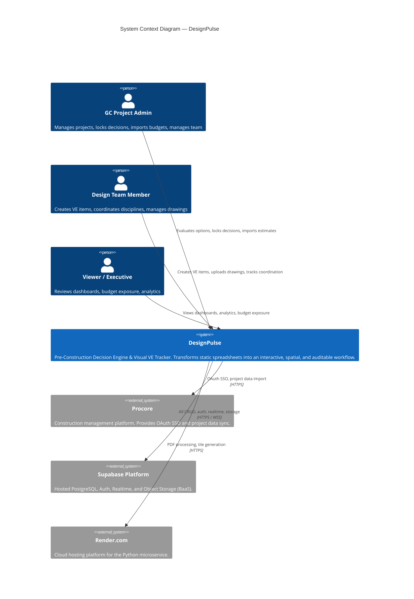
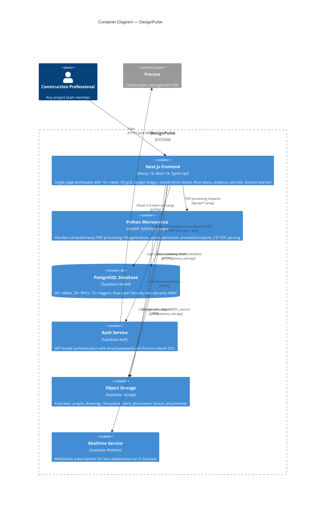
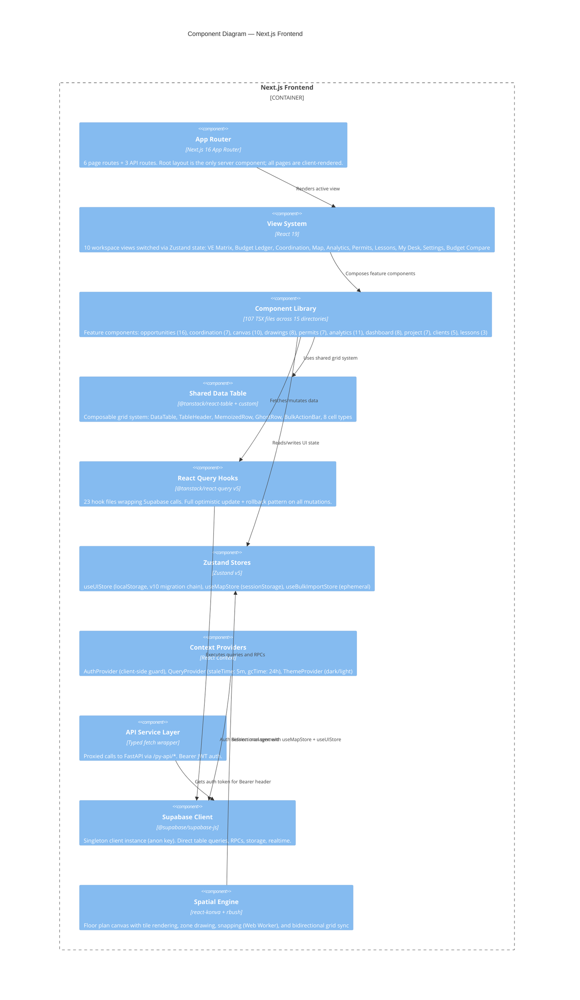
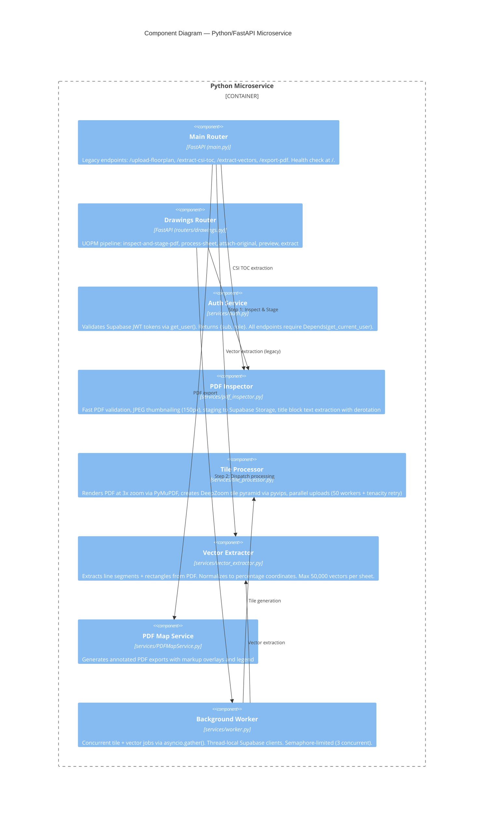
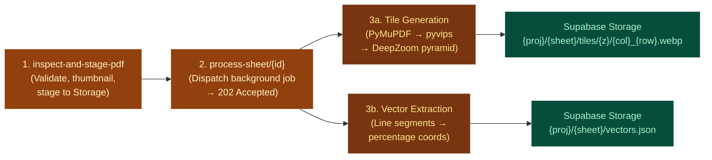
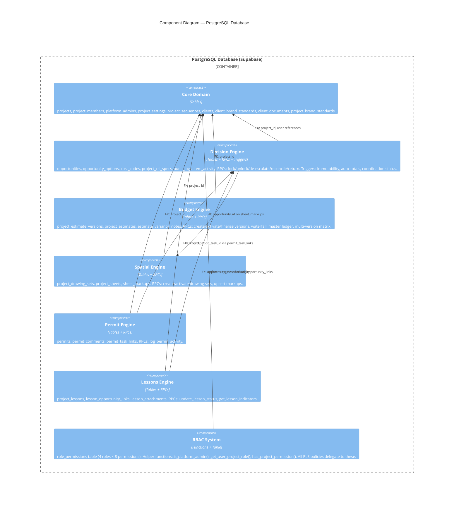
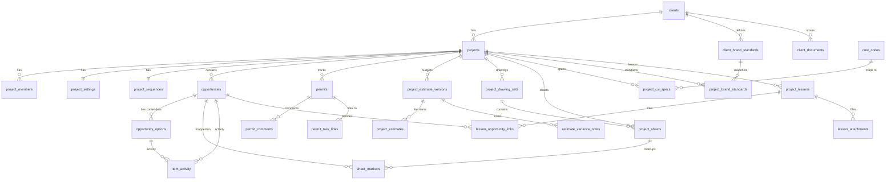

# DesignPulse — Architecture Document (C4 Model)

> **Last Updated:** 2026-05-22  
> **Status:** Living Document  
> **Application Version:** v0.17.1 (Sizing Locks, Zero-Baselines & Timeline Budget Deltas)  
> **Architecture Model:** [C4 Model](https://c4model.com/) by Simon Brown

---

## Table of Contents

- **C4 Diagrams**
  1. [Level 1 — System Context](#level-1--system-context)
  2. [Level 2 — Container](#level-2--container)
  3. [Level 3 — Component](#level-3--component)
  4. [Level 4 — Code](#level-4--code)
- **Supplementary**
  - [A. Domain Glossary](#appendix-a--domain-glossary)
  - [B. Architectural Patterns](#appendix-b--architectural-patterns)
  - [C. Dependency Inventory](#appendix-c--dependency-inventory)
  - [D. Infrastructure & Deployment](#appendix-d--infrastructure--deployment)
  - [E. Known Gaps & Technical Debt](#appendix-e--known-gaps--technical-debt)

---

# Level 1 — System Context

> *"A System Context diagram is a good starting point for diagramming and documenting a software system, allowing you to step back and see the big picture."*

This diagram shows **DesignPulse** as a single box and its relationships with the people who use it and the external systems it integrates with.



### Actors

| Actor | Role | Key Capabilities |
|-------|------|-------------------|
| **GC Project Admin** | `project_admin` | Full access: lock/unlock decisions, import budgets, manage team, configure settings |
| **GC Admin** | `gc_admin` | Operational: create VE items, lock options, manage coordination, import estimates |
| **Design Team Member** | `design_team` | Collaborative: create items, upload drawings, update coordination checklists |
| **Viewer / Executive** | `viewer` | Read-only: dashboards, budget exposure, analytics, export reports |
| **Platform Admin** | `platform_admin` (super) | Cross-project: system settings, user management, CSI training, global cost codes |

### External Systems

| System | Integration | Protocol |
|--------|-------------|----------|
| **Procore** | OAuth 2.0 SSO + project detail import | HTTPS (REST) |
| **Supabase Platform** | Database, Auth, Realtime subscriptions, Object Storage | HTTPS + WebSocket |
| **Render.com** | Hosts Python/FastAPI microservice (Docker) | HTTPS |

---

# Level 2 — Container

> *"A Container diagram zooms into the software system, showing the high-level technical building blocks (containers) and how they interact."*

A **container** is a separately deployable/runnable unit (e.g., a web app, a microservice, a database).



### Container Inventory

| Container | Technology | Port | Purpose | Deployment |
|-----------|-----------|------|---------|------------|
| **Next.js Frontend** | Next.js 16 (App Router), React 19, TypeScript 6 | 8000 (dev) | Primary UI — 107 components, 23 hooks, 3 stores | Manual (no config detected) |
| **Python Microservice** | FastAPI, Python 3.12, PyMuPDF, pyvips | 8001 (dev) / 10000 (prod) | PDF pipeline: inspect → stage → tile → vector → export | Render.com (Docker) |
| **PostgreSQL Database** | Supabase Hosted PostgreSQL | N/A | 30+ tables, 25+ RPCs, 15+ triggers, dynamic RBAC via RLS | Supabase cloud |
| **Auth Service** | Supabase Auth | N/A | JWT tokens, email/password, Procore OAuth | Supabase cloud |
| **Object Storage** | Supabase Storage | N/A | 4 buckets for drawings, documents, attachments | Supabase cloud |
| **Realtime Service** | Supabase Realtime | N/A | 3 WebSocket channels for live collaboration | Supabase cloud |

### Inter-Container Communication

| From → To | Transport | Auth Mechanism | Purpose |
|-----------|-----------|----------------|---------|
| Frontend → Database | Supabase JS SDK (HTTPS) | `anon` key + RLS policies | All CRUD, RPC calls |
| Frontend → Microservice | `/py-api/*` Next.js proxy | Bearer JWT (Supabase token) | PDF upload, processing, export |
| Frontend → Realtime | WebSocket (WSS) | Supabase session | Live data sync (3 channels) |
| Frontend → Storage | Supabase JS SDK (HTTPS) | `anon` key + RLS | File upload/download |
| Microservice → Database | Supabase SDK (HTTPS) | `service_role` key (bypasses RLS) | Sheet status updates |
| Microservice → Storage | Supabase SDK (HTTPS) | `service_role` key (bypasses RLS) | Tile pyramid upload, staged PDFs |
| Auth → Procore | OAuth 2.0 (HTTPS) | Client ID/Secret | SSO token exchange |

---

# Level 3 — Component

> *"A Component diagram zooms into an individual container to show the components inside it and their relationships."*

## 3.1 — Next.js Frontend Components



### Page Routes

| Route | Type | Description |
|-------|------|-------------|
| `/` | Redirect | → `/dashboard` (via `next.config.mjs`) |
| `/login` | Client | Email/password + Procore OAuth login |
| `/dashboard` | Client | Projects + Clients dual-tab dashboard |
| `/project/[projectId]` | Client | **Main workspace** (143 lines) — dynamic view orchestrator switching between 10 isolated views via `useUIStore.activeView` |
| `/project/[projectId]/item/[itemId]` | Client | Pop-out item detail view |
| `/clients/[id]` | Client | Client detail with tabs (Profile, Brand Standards, Documents, Projects, Lessons) |
| `/sandbox/map` | Client | Map development sandbox |
| `/auth/success` | Client | Procore OAuth popup success handler |
| `/api/auth/procore/callback` | API Route | Procore OAuth callback (exchanges code for token) |
| `/api/auth/procore/launch` | API Route | Initiates Procore OAuth flow |
| `/api/procore/project-details` | API Route | Proxies Procore project data |

### View System (within `/project/[projectId]`)

| View Key | Feature | Primary Component | Size |
|----------|---------|-------------------|------|
| `dashboard` | Value Matrix | `OpportunityGridV2` | 57 KB |
| `dashboard-v2` | Budget Ledger | `OpportunityGridV2` (shared, merged mode) | 57 KB |
| `coordination` | Coordination Board | `CoordinationTable` | 30 KB |
| `map` | Floor Plans | `FloorplanCanvas` + `DrawingGrid` | 37 KB + 28 KB |
| `analytics` | Analytics | `AnalyticsDashboard` + role-specific dashboards | — |
| `permits` | Permit Tracker | `PermitTable` | 36 KB |
| `lessons` | Lessons Learned | `LessonsLearnedView` | — |
| `my-desk` | Personal Dashboard | `MyDeskDashboard` | — |
| `settings` | Project Settings | `ProjectSettings` | 71 KB |
| `budget-compare` | Budget Comparison | `VersionComparisonViewer` | 23 KB |

### Zustand Stores

| Store | File | Persistence | Key Responsibilities |
|-------|------|-------------|----------------------|
| `useUIStore` | `src/stores/useUIStore.ts` (482 lines) | `localStorage` (`design-pulse-ui-prefs`, v10 with migration chain v0→v10) | Active view per project, selected row, grid modes, column visibility/order/pinning per project, panel collapse states, card ordering, filter prefs |
| `useMapStore` | `src/stores/useMapStore.ts` (118 lines) | `sessionStorage` (`designpulse-map-session`, v2) | Tool mode (8 modes), selected zones, active sheet, open sheet tabs, pending polygon, editing zone |
| `useBulkImportStore` | Inline in `BulkImportModal.tsx` | None (ephemeral) | Staged Excel import rows for coordination task bulk import |

**Bidirectional Sync:** `useUIStore.setSelectedOpportunityId` ↔ `useMapStore.setSelectedZoneIds` — selecting a grid row highlights the map zone, and selecting a zone highlights the grid row.

### React Query Hook Layer

| Hook File | Domain | Queries | Mutations |
|-----------|--------|---------|-----------|
| `useOpportunityQueries.ts` (920 lines) | VE Decision Engine | `useOpportunities`, `useOpportunity`, `useAllProjectOptions`, `usePendingEstimateUpdates` | `useCreateOpportunity`, `useUpdateOpportunity`, `useDeleteOpportunity`, `useLockOption`, `useUnlockOpportunityOption`, `useToggleOptionBudget`, `useCreateOption`, `useUpdateOption`, `useDeleteOption`, `useReorderOptions`, `useReconcileOpportunity`, `useReturnOpportunity`, `useDeEscalateOpportunity`, `useUpdateCoordinationDetails`, `useUpdateOptionRequirements`, `useBulkImportCoordinationTasks` |
| `useEstimateQueries.ts` | Budget Engine | `useEstimateVersions`, `useEstimateLines`, `useBudgetWaterfall`, `useEstimateComparison`, `useMasterLedgerGrid`, `useMultiVersionMatrix`, `useBudgetVersionTimeline`, `useVarianceNotes`, `useVarianceNotesForGrid` | `useUploadEstimate`, `useActivateEstimateVersion`, `useDeleteEstimateVersion`, `useUpdateEstimateAssumptions` |
| `useMapQueries.ts` | Floor Plans | `useProjectSheets`, `useSheetMarkups` | `useUpsertSheetMarkups` + sheet CRUD |
| `useProjectCoreQueries.ts` | Projects & Settings | `useProjects`, `useProjectSettings`, `useProjectMembers` | `useCreateProject`, `useUpdateProjectCore`, `useDeleteProjectCore`, `useUpdateProjectSettings`, `useAddProjectMember`, `useUpdateProjectMemberRole`, `useRemoveProjectMember` |
| `useClientQueries.ts` | Clients | `useClients`, `useClient`, `useClientProjectsMetrics`, `useClientBrandStandards`, `useClientDocuments` | `useCreateClient`, `useUpdateClient`, `useDeleteClient`, `useCreateBrandStandard`, `useUpdateBrandStandard`, `useDeleteBrandStandard`, `useUploadClientDocument`, `useDeleteClientDocument` |
| `useGlobalQueries.ts` | Admin/Global | `useSystemUsers`, `useRolePermissions`, `useCsiTrainingSuggestions` | `useBulkUpdateUserProjects`, `useToggleCsiVerified`, `useRemapGlobalCsiEntry`, `useCreateCostCode`, `useDeleteCostCode` |
| `usePermitQueries.ts` | Permits | `usePermits`, `usePermitComments`, `usePermitTaskLinks` | Permit CRUD mutations |
| `useLessonQueries.ts` | Lessons Learned | `useLessons`, `useLessonIndicators` | Lesson CRUD + attachment mutations |
| `useDrawingSetQueries.ts` | Drawing Sets | `useDrawingSets` | `useCreateDrawingSet`, `useActivateDrawingSet` |
| `useCsiQueries.ts` | Project CSI Specs | `useProjectCsiSpecs` | CSI spec mutations |
| `useCompanyCsiQueries.ts` | Company CSI | `useCompanyCsiDefaults`, `useCompanyCsiRosettaView` | `useBulkUpsertCompanyCsiDefaults`, `useSeedProjectFromCompanyDefaults` |
| `useItemActivity.ts` | Activity Feed | `useActivityFeed` (infinite query with pagination) | `useAddComment`, `useUpdateComment`, `useDeleteComment` |
| `useProjectAnalyticsQueries.ts` | Analytics | `useTradeVariances`, `useGcBottleneckMetrics`, `useOwnerRoiMetrics`, `useDesignCompletionMetrics` | — |
| `usePlatformAdmin.ts` | Platform Admin | `useIsPlatformAdmin` | — |
| `useUpsertVarianceNote.ts` | Variance Notes | — | `useUpsertVarianceNote` |

---

## 3.2 — Python Microservice Components



### UOPM Pipeline (Upload Once, Process Many)



### API Endpoints

| Method | Path | Handler | Purpose |
|--------|------|---------|---------|
| GET | `/` | `main.py` | Health check |
| POST | `/upload-floorplan/{sheet_id}` | `main.py` | Legacy: PDF page → PNG conversion |
| POST | `/extract-csi-toc` | `main.py` | Rosetta Stone: extract CSI codes from PDF TOC |
| POST | `/extract-vectors/{sheet_id}` | `main.py` | Extract snapping vectors from PDF |
| POST | `/export-pdf/{sheet_id}` | `main.py` | Annotated PDF export with markups + legend |
| POST | `/drawings/inspect-and-stage-pdf` | `drawings.py` | UOPM Step 1: validate, thumbnail, stage |
| POST | `/drawings/process-sheet/{sheet_id}` | `drawings.py` | UOPM Step 2: dispatch background job (202 Accepted) |
| POST | `/drawings/attach-original/{sheet_id}` | `drawings.py` | Attach source PDF for export/vectors |
| GET | `/drawings/preview/{proj}/{key}/{page}` | `drawings.py` | High-res JPEG preview (2000px) |
| POST | `/drawings/extract/{proj}/{key}` | `drawings.py` | Title block zone text extraction |

### Startup Lifecycle

1. Clean orphaned temp tile directories
2. Zombie sweep: revert stuck `processing` sheet rows → `error`
3. Staged PDF TTL sweep: delete `staged/` files older than 72 hours

---

## 3.3 — PostgreSQL Database Components



### Entity Relationship Diagram



### Key Triggers

| Trigger | Table | Purpose |
|---------|-------|---------|
| `trg_generate_opportunity_display_id` | `opportunities` | Auto-generates `VE-001` / `CD-001` display IDs from `project_sequences` |
| `trg_enforce_financial_immutability` | `opportunities` | Prevents modification of Approved records (bypass via `SET LOCAL`) |
| `trg_enforce_options_immutability` | `opportunity_options` | Prevents child modification when parent is Approved |
| `trg_sync_parent_opportunity_totals` | `opportunity_options` | Recalculates parent `cost_impact` from locked/budgeted/max options |
| `trg_auto_update_coordination_status` | `opportunities` | Auto-transitions `coordination_status` based on discipline completion |
| `trg_cascade_soft_delete_opportunities` | `opportunities` | Soft-deletes children + cleans `permit_task_links` |
| `trg_ui_system_activity_*` | `opportunities`, `options` | Generates `system_log` entries in `item_activity` |
| `trg_item_activity_immutability` | `item_activity` | Prevents mutation of system-generated logs |
| `trg_enforce_variance_note_immutability` | `estimate_variance_notes` | Prevents edits after version finalization |
| `trg_audit_*` | Multiple | Writes to `audit_logs` when audit logging is enabled |
| `trg_*_updated_at` | Multiple | Auto-updates `updated_at` timestamp |

### Key RPC Functions

| Category | RPC | Purpose |
|----------|-----|---------|
| **Decision Engine** | `lock_opportunity_option()` | Lock contender → set parent Approved → merge `coordination_details` |
| | `unlock_opportunity_option()` | Reverse lock → reset to Draft (immutability escape hatch) |
| | `de_escalate_opportunity()` | Remove escalated coordination item from VE matrix |
| | `reconcile_and_incorporate_opportunity()` | Budget reconciliation escape hatch |
| | `return_opportunity_to_design()` | Return locked item for redesign with revised cost |
| | `update_coordination_details_delta()` | Race-safe JSONB merge with `FOR UPDATE` lock |
| | `update_option_requirements_delta()` | Race-safe option-level JSONB merge |
| | `bulk_import_coordination_tasks()` | Atomic batch insert of coordination tasks |
| | `reorder_opportunity_options()` | Bulk reorder via JSONB array |
| | `toggle_option_budget()` | Toggle `include_in_budget` flag |
| **Budget Engine** | `create_estimate_version()` | Create version header + atomic active swap |
| | `bulk_append_estimate_lines()` | Chunked bulk insert + variance notes |
| | `activate_estimate_version()` | Atomic version swap + budget sync to `project_settings` |
| | `finalize_estimate_version()` | Finalize + optionally incorporate VE items |
| | `get_project_budget_waterfall()` | Server-side budget aggregation |
| | `get_master_ledger_grid()` | Master budget ledger aggregation |
| | `compare_estimate_versions()` | Estimate diff with IDOR protection |
| | `get_multi_version_matrix()` | Multi-version forensic matrix |
| | `get_budget_version_timeline()` | Version history timeline |
| **Spatial** | `create_drawing_set()` / `activate_drawing_set()` | Drawing set lifecycle |
| | `upsert_sheet_markups()` | Atomic replace of zone markups per (sheet, opportunity) |
| **CSI** | `bulk_upsert_company_csi_defaults()` | Company-level CSI training |
| | `seed_project_from_company_defaults()` | Seed project CSI from company defaults |
| | `remap_global_csi_entry()` | Remap CSI codes globally |
| **Admin** | `create_new_project()` | Project + admin member + settings in one transaction |
| | `is_platform_admin()` | Super-admin status check |
| | `get_system_users()` | List all users with project assignments |

---

# Level 4 — Code

> *"The optional Level 4 zooms into individual components to show how they are implemented. This is typically a UML class diagram or code-level detail."*

## 4.1 — Project File Structure

```
design-pulse/                           # Informal monorepo (no workspace manager)
│
├── designpulse-next/                   # ── NEXT.JS FRONTEND ─────────────────
│   ├── src/
│   │   ├── app/                        #   App Router: 6 pages + 3 API routes
│   │   │   ├── layout.tsx              #     Root layout (ONLY server component)
│   │   │   ├── globals.css             #     Tailwind v4 + design tokens
│   │   │   ├── login/page.tsx          #     Login (email + Procore OAuth)
│   │   │   ├── dashboard/page.tsx      #     Projects + Clients dashboard
│   │   │   ├── project/[projectId]/    #     Main workspace (143-line dynamic orchestrator)
│   │   │   │   └── item/[itemId]/      #       Pop-out item detail
│   │   │   ├── clients/[id]/page.tsx   #     Client detail (tabbed)
│   │   │   ├── auth/success/page.tsx   #     Procore OAuth success handler
│   │   │   ├── sandbox/map/page.tsx    #     Map dev sandbox
│   │   │   └── api/                    #     API routes (Procore OAuth + proxy)
│   │   ├── components/                 #   107 TSX files across 15 directories
│   │   │   ├── opportunities/ (16)     #     VE items: grid cells, cards, columns
│   │   │   ├── coordination/ (7)       #     Board, table, detail panel, import
│   │   │   ├── canvas/ (10)            #     Map zones, tiles, legend, viewport
│   │   │   ├── drawings/ (8)           #     PDF import, drawing grid, wizard
│   │   │   ├── analytics/ (11)         #     Charts, role-specific dashboards
│   │   │   ├── data-table/ (10+8)      #     Shared grid system + cell types
│   │   │   ├── dashboard/ (8)          #     Global settings, project/client CUD
│   │   │   ├── project/ (7)            #     Settings, estimates, CSI, brand std
│   │   │   ├── permits/ (7)            #     Permit board, table, detail, kanban
│   │   │   ├── clients/ (5)            #     Brand standards, documents, profile
│   │   │   ├── views/ (4)              #     View wrappers (VE, Budget, Coord, Lessons)
│   │   │   ├── lessons/ (3)            #     Detail panel, columns, templates
│   │   │   ├── layout/ (2)             #     Sidebar, account dropdown
│   │   │   ├── mydesk/ (2)             #     Personal dashboard
│   │   │   └── ui/ (7)                 #     Button, ModalShell, comboboxes, filters, rich text
│   │   ├── hooks/ (23)                 #   React Query hooks (domain-organized)
│   │   ├── stores/ (3)                 #   Zustand: UIStore, MapStore, ColumnSlice
│   │   ├── types/ (5)                  #   database.types, models, map.types, tanstack.d, exceljs.d
│   │   ├── lib/ (8+)                   #   Constants, utilities, cn.ts, excel parsers
│   │   ├── providers/ (3)              #   Auth, Query, Theme
│   │   ├── services/ (1)              #   api.ts (FastAPI proxy client)
│   │   ├── utils/ (2)                  #   financialMath, geometry
│   │   ├── workers/ (1)                #   snapping.worker.ts (Web Worker)
│   │   ├── scripts/ (1)                #   seedCompanyDefaults.ts
│   │   └── supabaseClient.ts           #   Singleton Supabase client
│   ├── next.config.mjs                 #   Proxy: /py-api/* → localhost:8000
│   ├── tsconfig.json                   #   Strict mode, @/* path alias
│   └── package.json                    #   31 deps, dev on port 8000
│
├── designpulse-backend/                # ── PYTHON MICROSERVICE ──────────────
│   ├── main.py (620 lines)             #   FastAPI app + legacy endpoints
│   ├── routers/
│   │   └── drawings.py                 #   UOPM pipeline endpoints
│   ├── services/
│   │   ├── auth.py                     #   JWT validation
│   │   ├── models.py                   #   Pydantic schemas
│   │   ├── pdf_inspector.py            #   PDF validation + thumbnailing
│   │   ├── tile_processor.py           #   DeepZoom tile pyramid (pyvips)
│   │   ├── vector_extractor.py         #   Structural line extraction
│   │   ├── PDFMapService.py            #   Annotated PDF export
│   │   └── worker.py                   #   Background job runner
│   ├── Dockerfile                      #   Python 3.12-slim (Render.com)
│   ├── requirements.txt                #   Python dependencies
│   └── start.ps1                       #   Local dev launcher
│
├── designpulse-map-module/             # ── LEGACY MAP PROTOTYPE (deprecated)
│   ├── backend/                        #   Overlapping PDF service
│   └── frontend/                       #   Separate React map components
│
├── supabase_schema.sql (153 KB)        # ── MASTER DATABASE SCHEMA ───────────
├── supabase_migrations/ (1)            #   Active migration
├── db_migrations_archive/ (14)         #   Historical migrations
│
├── .agent/skills/ (7)                  # ── AI AGENT SKILLS ──────────────────
│   ├── frontend-architecture/ (38 KB)
│   ├── database-guardrails/ (16 KB)
│   ├── data-table-architecture/ (8 KB)
│   ├── api-and-integration/ (3.5 KB)
│   ├── verify-feature/ (1.8 KB)
│   ├── map-feature-context/ (1.6 KB)
│   └── deep-review/ (1.1 KB)
│
├── AGENTS.md                           # AI agent context + routing table
├── README.md (52 KB)                   # Project docs + release notes (v0.6–v0.17)
└── FUTURE_IDEAS.md (9 KB)              # Roadmap proposals
```

## 4.2 — Type System

| File | Lines | Purpose |
|------|-------|---------|
| `src/types/database.types.ts` | 544 | **Hand-maintained** Supabase schema types. `Row`, `Insert`, `Update` variants per table. Covers core tables but missing some (e.g., `item_activity`, `project_lessons`, `drawing_sets`). |
| `src/types/models.ts` | 471 | Domain models extending DB row types with JSONB typing and computed fields. Key types: `Opportunity`, `OpportunityOption`, `ProjectSettings`, `Project`, `Client`, `ClientBrandStandard`, `ProjectCsiSpec`, `ProjectEstimateVersion`, `ProjectEstimateLine`, `MasterLedgerRow`, `BudgetWaterfallRow`, `RolePermission`, `UserPermissions`, `ProjectMember`, `ItemActivity`, `ProjectLesson`. |
| `src/types/map.types.ts` | 166 | Spatial types: `DrawingSet`, `ProjectSheet`, `Zone`, `Point`, `ToolMode`, `MapState`, `VectorLine`, `LayoutConfig`, `CanvasRenderSettings`, `MapSnappingSettings`, `SnapCallback`, `BBox`, `RBush<T>`, `InspectPdfResponse`, `StagedPageMeta`. |
| `src/types/tanstack.d.ts` | 57 | Module augmentation for `@tanstack/react-table` `TableMeta`. Extends with mutation results, option maps, cost codes, CSI specs, project members, permissions, grid navigation refs. |
| `src/types/exceljs.d.ts` | — | Type declaration for ExcelJS module. |

## 4.3 — React Query Cache Configuration

```typescript
// src/providers/QueryProvider.tsx
defaultOptions: {
  queries: {
    staleTime: 5 * 60 * 1000,   // 5 minutes
    gcTime: 24 * 60 * 60 * 1000, // 24 hours
  },
  mutations: {
    retry: 3,
  },
}
```

**Query Key Convention:** Structured `[entityType, scopeId]` tuples:

```
['opportunities', projectId]           ['estimate_versions', projectId]
['all_project_options', projectId]     ['estimate_lines', versionId]
['opportunity', opportunityId]         ['master-ledger-grid', projectId]
['project_settings', projectId]        ['budget-waterfall', projectId]
['projects']                           ['permits', projectId]
['project_members', projectId]         ['clients']
['project_sheets', projectId]          ['client', clientId]
['sheet_markups', sheetId]             ['system_users']
['activity_feed', entityType, entityId]
```

## 4.4 — Realtime Subscriptions

| Hook | Channel | Tables | Debounce | Invalidated Keys |
|------|---------|--------|----------|------------------|
| `useProjectRealtime` | `project-realtime-{id}` | `opportunities`, `opportunity_options`, `permits`, `permit_comments` | 300ms | 7 query keys |
| `useSheetRealtime` | `sheet-status-{id}` | `project_sheets` (UPDATE only) | 300ms | `project_sheets` |
| `useActivityFeed` (inline) | `activity-{id}` | `item_activity` | None | `activity_feed` |

## 4.5 — Storage Buckets

| Bucket | Purpose | Public | Path Convention |
|--------|---------|--------|-----------------|
| `project_drawings` | Tile pyramids, staged PDFs, vectors | No | `{project_id}/{sheet_id}/tiles/{z}/{col}_{row}.webp` |
| `floorplans` | Legacy PNGs + original PDFs | Yes | — |
| `client_documents` | Client reference documents | No | — |
| `lesson_attachments` | Lesson file attachments | No | — |

## 4.6 — Notable Large Files

| File | Size | Component |
|------|------|-----------|
| `GlobalSettingsModal.tsx` | 100 KB | CSI mappings, user management, cost codes |
| `ProjectSettings.tsx` | 71 KB | 12-tab project settings panel |
| `ProjectEstimateTab.tsx` | 62 KB | Budget estimate import + management |
| `OpportunityGridV2.tsx` | 57 KB | Main VE data grid (Value Matrix + Budget Ledger) |
| `FloorplanCanvas.tsx` | 37 KB | react-konva floor plan renderer |
| `useOpportunityQueries.ts` | 37 KB | VE decision engine hooks (920 lines) |
| `PermitTable.tsx` | 36 KB | Permit tracking grid |
| `SortableContenderCard.tsx` | 34 KB | Drag-and-drop contender card |
| `ExpandedCard.tsx` | 33 KB | Opportunity detail panel |
| `CoordinationTable.tsx` | 30 KB | Coordination board table |
| `EditableCell.tsx` | 30 KB | Editable grid cell component |

---

# Appendix A — Domain Glossary

| Term | Definition |
|------|------------|
| **Opportunity** | A single design element or VE item being evaluated (e.g., "Countertop Material"). The parent row. |
| **Option / Contender** | A relational sub-option for an Opportunity (e.g., "Concrete: $0", "Quartz: +$15k"). The child row. |
| **Locking** | Approving a contender. Sets parent status to `Approved`, overwrites `cost_impact`, triggers coordination. |
| **Potential Exposure** | `Math.max()` of unresolved options — worst-case financial risk for executives. |
| **Progressive Disclosure** | Data revealed based on workflow stage. Locked decisions unlock coordination checklists. |
| **Coordination Status** | Auto-calculated from per-discipline completion in `coordination_details` JSONB. |
| **Estimate Sync Status** | Tracks whether a locked VE item has been incorporated into the active budget version. |
| **UOPM** | Upload Once, Process Many — PDFs staged once, pages processed individually. |
| **Rosetta Stone** | CSI cost code mapping system — bridges different naming conventions across trades. |
| **Immutability Escape Hatch** | `SET LOCAL designpulse.bypass_immutability = 'true'` — transaction-scoped bypass in `SECURITY DEFINER` RPCs. |

---

# Appendix B — Architectural Patterns

### B.1 Supabase-First Data Layer
All CRUD flows directly through the Supabase JS client (with RLS enforcement). The Python microservice is only used for compute-heavy operations. There is no intermediate REST API for data operations.

```
Component → React Query Hook → supabase.from() / .rpc() → PostgreSQL (with RLS)
```

### B.2 Optimistic Updates with Rollback
Every React Query mutation (~20+) implements the full optimistic pattern:
1. `onMutate`: Cancel inflight queries → snapshot previous → `setQueryData` (optimistic) → return context
2. `mutationFn`: Execute Supabase RPC or table operation
3. `onError`: Restore from snapshot + toast error
4. `onSuccess`: Invalidate related caches for server truth

**Cross-cache invalidation example** (`useLockOption` invalidates 5 keys):
`opportunities`, `all_project_options`, `master-ledger-grid`, `budget-waterfall`, `pending_estimate_updates`

### B.3 Immutability + Escape Hatch
Database triggers enforce business rules (Approved records can't be modified). `SECURITY DEFINER` RPCs use `SET LOCAL` to bypass in controlled transactions: `unlock`, `reconcile`, `return-to-design`.

### B.4 Race-Safe JSONB Merging
`update_coordination_details_delta()` and `update_option_requirements_delta()` use `SELECT ... FOR UPDATE` row locks with shallow JSONB merge to prevent concurrent overwrites.

### B.5 Progressive Disclosure (Phase-Shifting)
Data revealed based on workflow stage. Once a decision is locked in Pre-Con, coordination checklists become actionable. The Coordination Board surfaces items where `coordination_status !== 'Not Required'` and `!== null`.

### B.6 Bidirectional Store Sync
`useUIStore` and `useMapStore` maintain two-way sync between the selected opportunity row and highlighted map zones. Selecting in the grid highlights on the canvas, and vice versa.

### B.7 Soft Deletes with Cascade
`is_deleted` boolean on opportunities, options, permits, and lessons. Trigger `trg_cascade_soft_delete_opportunities` soft-deletes children and cleans junction tables.

### B.8 Dynamic RBAC
`role_permissions` table maps 4 roles to 8 boolean permissions. `has_project_permission()` function is used in RLS policies for fine-grained access control. Roles can be reconfigured without code changes.

---

# Appendix C — Dependency Inventory

### C.1 Frontend Production (32 packages)

| Category | Package | Version |
|----------|---------|---------|
| **Framework** | `next` | `16.2.3` |
| | `react` / `react-dom` | `19.2.4` |
| **Data** | `@supabase/supabase-js` | `^2.103.0` |
| | `@tanstack/react-query` | `^5.99.0` |
| | `@tanstack/react-table` | `^8.21.3` |
| | `@tanstack/react-virtual` | `^3.13.24` |
| | `zustand` | `^5.0.12` |
| **Spatial** | `konva` / `react-konva` | `^10.2.5` / `^19.2.3` |
| | `rbush` | `^4.0.1` |
| | `react-zoom-pan-pinch` | `^4.0.3` |
| | `use-image` | `^1.1.4` |
| **DnD** | `@dnd-kit/core` | `^6.3.1` |
| | `@dnd-kit/sortable` | `^10.0.0` |
| | `@dnd-kit/utilities` | `^3.2.2` |
| **UI** | `lucide-react` | `^1.8.0` |
| | `framer-motion` | `^12.38.0` |
| | `sonner` | `^2.0.7` |
| | `next-themes` | `^0.4.6` |
| | `cmdk` | `^1.1.1` |
| **Rich Text** | `@tiptap/react` | `^3.23.4` |
| | `@tiptap/starter-kit` | `^3.23.4` |
| | `@tiptap/extension-placeholder` | `^3.23.4` |
| **Charts** | `recharts` | `^3.8.1` |
| **Export** | `jspdf` / `jspdf-autotable` | `^4.2.1` / `^5.0.7` |
| | `exceljs` | `^4.4.0` |
| **Utilities** | `date-fns` | `^4.1.0` |
| | `qs` | `^6.15.1` |
| | `clsx` | `^2.1.1` |

### C.2 Frontend Dev (7 packages)

`tailwindcss@^4`, `@tailwindcss/postcss@^4`, `typescript@^6.0.3`, `eslint@^9`, `eslint-config-next@16.2.3`, `@types/node`, `@types/react`, `@types/react-dom`, `@types/rbush`

### C.3 Backend (Python)

`fastapi`, `uvicorn`, `PyMuPDF` (fitz), `pyvips`, `supabase`, `tenacity`, `httpx`, `python-dotenv`, `Pillow`

---

# Appendix D — Infrastructure & Deployment

### D.1 Local Development

| Service | Port | Command |
|---------|------|---------|
| Next.js Frontend | 8000 | `npm run dev` (custom port via `next dev -p 8000`) |
| Python Backend | 8001 | `start.ps1` → `python -m uvicorn main:app --reload --host 127.0.0.1 --port 8001` |

> [!NOTE]
> **Unified Dev Ports:** `next.config.mjs` correctly proxies `/py-api/*` to port `8001` (`http://127.0.0.1:8001`), which is the exact port where FastAPI is launched by `start.ps1`. Next.js dev server runs on port `8000`.

### D.2 Production

| Component | Platform | Notes |
|-----------|----------|-------|
| Frontend | Unknown (no config detected) | No `vercel.json`, `fly.toml`, or deployment configuration |
| Backend | Render.com | Dockerfile exposes `$PORT` (default 10000) |
| Database | Supabase (hosted) | `yrfzwtemupbesyunggcm.supabase.co` |

### D.3 CI/CD

> [!CAUTION]
> **No automated pipelines exist.** No GitHub Actions, Vercel config, or Render IaC. Deployment is entirely manual.

### D.4 Styling Configuration

- **Tailwind CSS v4** — CSS-first config in `globals.css` (no `tailwind.config.js`)
- **Fonts:** Outfit (sans-serif primary via `next/font/google`), Roboto Mono (monospace)
- **Dark mode:** Class-based via `next-themes` (`@custom-variant dark`)
- **Design tokens:** CSS custom properties for colors, glassmorphism, milestone fills
- **Data table CSS:** Standardized `.dt-*` class system for grid components

---

# Appendix E — Known Gaps & Technical Debt

### Critical

| Issue | Impact | Details |
|-------|--------|---------|
| **No automated tests** | High | No test framework configured (no jest, vitest, playwright). Backend has ad-hoc debug scripts only. |
| **No CI/CD** | High | Fully manual deployment. No automated build, lint, or deploy pipelines. |
| **No middleware.ts** | Medium | Auth is purely client-side. No server-side route protection for SSR. |
| **No error boundaries** | Medium | No `loading.tsx` or `error.tsx` anywhere. No route-level error handling. |

### Architecture

| Issue | Impact | Details |
|-------|--------|---------|
| **Hand-maintained DB types** | Medium | `database.types.ts` is not auto-generated via `supabase gen types`. Several tables missing. |
| **Mega-components** | Medium | 5 files exceed 50 KB (`GlobalSettingsModal` = 100 KB). Should be decomposed. |
| **Mega-page refactored** | Resolved | `/project/[projectId]/page.tsx` refactored from 957 lines to a clean 143-line orchestrator. Views isolated under `src/components/views/`. |
| **Legacy map module** | Low | `designpulse-map-module/` is a deprecated prototype that should be removed. |
| **Inconsistent barrel exports** | Low | Only `data-table/` uses barrels. Other feature directories use direct imports. |
| **Missing Supabase CLI** | Low | No `supabase/` directory for local dev. Schema managed via raw 153 KB SQL file. |
| **Package name** | Cosmetic | `package.json` name is `sitepulse-next` (legacy), should be `designpulse-next`. |

### Security

| Issue | Impact | Details |
|-------|--------|---------|
| **Backend `.env` secrets** | High | Service role key in `designpulse-backend/.env` — verify not tracked in git history. |
| **No server-side auth** | Medium | All auth guards are client-side JavaScript. SSR/API routes beyond Procore callbacks are unprotected. |

---

*This document follows the [C4 model](https://c4model.com/) for software architecture documentation. It was generated via automated architecture analysis on 2026-05-21 and should be updated as the system evolves.*
